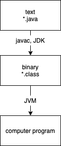

# Notes
## Section 1: Intro - What is Java and How It Works

1. You write in a `.java` file (text file)
2. `.java` will be turned into a binary format by `javac` (JDK)
    * `.java` file needs to be turned into a binary file that can be read by computer
3. You get a binary file for every file or class you create
4. You need to turn this binary file to a computer program
    * Java uses JRE and JVM
    * JRE: Java Runtime Environment
        * JRE sets up, creates, and runs JVM
    * JVM: Java Virtual Machine
        * JVM is a virtual machine or simulated computer
        * This enables any computer/machine to run your java file.
    * Binary File --> JRE --> JVM